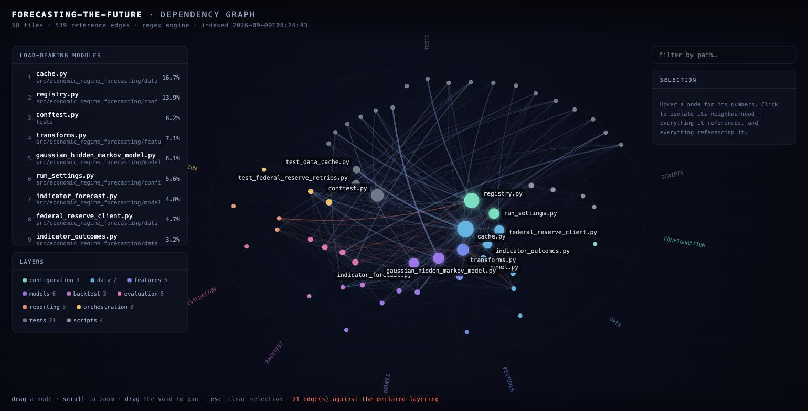

# Tooling

What lives in `.claude/`, what each piece is for, and how to drive it.

This repository installs the [Foundry](https://github.com/Jeddy-Xie/Foundry)
engines rather than carrying its own copy of them, and adds four project-local
skills for the things only this repository needs. Nothing here changes what the
model does; it changes what the tooling refuses to let anyone do quietly.

---

## Contents

1. [What is installed](#what-is-installed)
2. [The graph, and the picture of it](#the-graph-and-the-picture-of-it)
3. [`/layers` — the layering, as an exit code](#layers--the-layering-as-an-exit-code)
4. [The freeze guard — one forbidden act, compiled](#the-freeze-guard--one-forbidden-act-compiled)
5. [The test covenant](#the-test-covenant)
6. [`/register` and `/resolve` — the forecast register](#register-and-resolve--the-forecast-register)
7. [Building things: `/crucible:unit`](#building-things-crucibleunit)
8. [Stress-testing an idea: `/anvil:stress`](#stress-testing-an-idea-anvilstress)
9. [What is gitignored, and why](#what-is-gitignored-and-why)
10. [Open findings](#open-findings)

---

## What is installed

`.claude/settings.json` declares the Foundry marketplace and enables Crucible.
The source is a **directory**, pointing at the local checkout:

```json
{"extraKnownMarketplaces": {"foundry": {
    "source": {"source": "directory", "path": "/Users/jpmorgan/Projects/Foundry"}}}}
```

One consequence worth knowing: a directory marketplace serves **whatever branch
that working tree currently has checked out**. If Foundry is sitting on a unit
branch, that is the version this repository gets. Switch to a `github` source
once the merge queue is clear and it pins to `main` instead.

| what | where it comes from |
|---|---|
| `/crucible:graph`, `/crucible:unit`, the hooks, the standards pack | Foundry marketplace, `crucible@foundry` |
| `/anvil:stress`, `/anvil:outcome` | Foundry marketplace — **pending your merge**, see below |
| `/graph-view`, `/layers`, `/register`, `/resolve` | `.claude/skills/`, project-local |
| the freeze guard | `.claude/hooks/freeze_guard.py`, project-local |

Crucible is configured in `.claude/crucible.json` with `protected_branches: []`,
because this repository works directly on `main` and its git guard would
otherwise block every commit.

---

## The graph, and the picture of it

`/crucible:graph` builds a def/ref graph of the repository and ranks it with a
personalised PageRank. It is the right tool for *"what does this change reach"*:

```console
$ /crucible:graph impact                     # blast radius of the current diff
$ /crucible:graph symbol assemble_point_in_time_panel
$ /crucible:graph                            # ranked orientation map
```

It answers in text, in one turn. Use it constantly.

`/graph-view` draws the same numbers — it imports graphify's own `build_graph`
and `pagerank`, so the picture and the text agree by construction:

```console
$ python3 scripts/graph_view.py --open
graph_view: 58 nodes, 539 edges (regex engine)
  16.69%  in:47  out:14  src/economic_regime_forecasting/data/cache.py
  13.87%  in:24  out:8   src/economic_regime_forecasting/configuration/registry.py
   8.19%  in:25  out:3   tests/conftest.py
   7.07%  in:22  out:6   src/economic_regime_forecasting/features/transforms.py
   6.10%  in:30  out:13  src/economic_regime_forecasting/models/gaussian_hidden_markov_model.py
  21 edge(s) run against the declared layering (drawn hot)
→ artifacts/2026-09-09/graph.html
```



**How to read it.** Two facts are encoded in the coordinates:

- **Distance from the centre is rank.** The middle is where the load-bearing
  modules are. The rim is leaf code. A file drifting inward over releases is
  acquiring responsibility nobody decided to give it.
- **Angle is layer**, labelled around the rim, so the architecture reads as
  sectors and you can see at a glance which parts talk to which.

Node size is PageRank share. Edge brightness is reference strength. Edges drawn
in ember run **against the declared layering** — they come from
`scripts/layer_check.py`, and the count sits in the footer.

Click a node to isolate its neighbourhood; the arrowheads only appear then,
because direction on 539 edges at once is noise. The legend doubles as a layer
filter — hiding `tests` is usually the first thing you want. The layout is
seeded, so the same repository state draws the same picture.

**What the current picture says.** `data/cache.py` carries **16.7%** of the
graph's rank with 47 inbound edges. That is CLAUDE.md's rule — *every cache write
goes through `data/cache.py`* — showing up as measured structure rather than as a
sentence. The architecture and the graph agree. The day they stop agreeing, this
is where you will see it first.

The page is a deliverable, so it lands in `artifacts/` and is gitignored.
Regenerate it; don't commit it.

---

## `/layers` — the layering, as an exit code

The package docstring declares which layer may import which:

```
configuration  ->  (nothing)          models      ->  features, configuration
data           ->  configuration      backtest    ->  models, features, data, configuration
features       ->  configuration      evaluation  ->  (plain arrays; nothing above)
                                      reporting   ->  evaluation, models
```

Until now nothing read it. `scripts/layer_check.py` parses that table out of the
docstring, walks every import with `ast`, and exits non-zero on a violation:

```console
$ python3 scripts/layer_check.py
declared layers (7): backtest, configuration, data, evaluation, features, models, reporting
  ...
orchestration (undeclared package-root modules, exempt):
  src/economic_regime_forecasting/command_line_interface.py
  src/economic_regime_forecasting/pipeline_gates.py

layer_check: 7 violation(s).
  src/economic_regime_forecasting/evaluation/verdict.py:40
    evaluation may import nothing — not configuration
  ...
```

The docstring stays the single source of truth: change the declared layering and
the check follows. There is no second copy of the rules to drift.

**A violation means one of two things**, and they need opposite fixes. Either the
import is wrong and the code should move, or the dependency is real and sensible
and simply was never written down, in which case amend the docstring — in the
commit that argues for it, never silently to turn the check green. Editing the
table to match whatever the code happens to do converts a specification into a
description, which is worth nothing.

It currently exits 1. See [Open findings](#open-findings).

---

## The freeze guard — one forbidden act, compiled

CLAUDE.md says it plainly:

> The decision rule does not move. Changing one after seeing results is the
> single forbidden act.

That sentence is advisory — a rule in a context window, obeyed most of the time.
`.claude/hooks/freeze_guard.py` is the same rule as a blocking check.

**As a hook**, it refuses any edit to `proving/experiments/*/experiment.json`, to
the two append-only forecast ledgers, and — since ADR 0008 — to
`submission/forecasts.csv` and `submission/manifest.json`:

```console
DENY: 'proving/experiments/0001-.../experiment.json' holds the pre-registered
decision rule, and CLAUDE.md names changing it after seeing results as the single
forbidden act…
```

**As a check**, it asserts from git history that nothing has moved:

```console
$ python3 .claude/hooks/freeze_guard.py --check
FROZEN     proving/experiments/0001-regime-conditional-forecast-skill/experiment.json
           registered 27b2b7f 2026-09-08 feat(evaluation): scoring, calibration,
           block bootstrap, and the pre-registration; unmodified since.

freeze_guard: 1 frozen file(s) intact.
```

That is a verifiable claim, not a promise: the pre-registration was committed in
`27b2b7f` and git says it has not been touched since. Worth wiring into
`check-gates` or CI, where it becomes a fact anyone can confirm.

**Thawing is possible, and deliberate.** A file nobody can ever change is a file
people route around, so there is a door — with your name on it:

```console
$ python3 .claude/hooks/freeze_guard.py --thaw "new experiment 0002, nothing run yet" \
      --subject proving/experiments/0002-.../experiment.json --by jeddy
THAWED (one write): proving/experiments/0002-.../experiment.json
```

The token authorises **exactly one** write and is consumed by it. If you thaw a
threshold on the live experiment, the reason belongs in `docs/adr/`.

Omitting `--subject` sweeps every frozen file **except** the two outward-facing
ones (`SHIPPING_GLOBS`: `submission/forecasts.csv`, `submission/manifest.json`).
The command prints what it withheld. Shipping is opt-in, by name — see below.

**Shipping the submission is the same door.** Since ADR 0008 the pipeline default
is the honest configuration, which is not the one that produced
`submission/forecasts.csv`. So the routine pipeline step is
`poetry run forecast submit --verify-only`, which writes nothing and prints the
approved, live and producing configuration hashes; plain `forecast submit`
refuses with exit 2 unless the run *is* the approved configuration or a token
authorises it. Re-shipping is three deliberate steps:

`--subject submission/forecasts.csv` is **required**, not a convenience: a bare
`--thaw` never names the submission, and neither reader of the token will infer
it. That is what stops a thaw minted for the pre-registration from silently
authorising a re-ship (ADR 0008).

```console
$ python3 .claude/hooks/freeze_guard.py --thaw "re-ship under the honest default" \
      --subject submission/forecasts.csv --by jeddy
$ poetry run forecast submit
$ # then set CONFIGURATION_HASH_APPROVED_FOR_SHIPPING in
$ # src/economic_regime_forecasting/configuration/shipping_approval.py, same commit
```

The token has **two readers** — this hook and `submit()`'s guard — and whichever
acts first consumes it. So an editor that touches `submission/` after you mint one
will eat it, and `submit` will refuse again. Mint it immediately before the
submit. The write records `shipped_under_authorisation` (reason, who, when) in
`submission/manifest.json`, which is what puts a name on the decision.

---

## The test covenant

This ships with Crucible; you do not configure it beyond
`protect_tests: true`. It is stricter than "don't delete tests":

- **Weakening is measured, not guessed.** It counts assertion markers before and
  after an edit. Fewer out than in is weakening, and it is blocked. Commenting an
  assertion out counts as removing it. Overwriting a test file with under 40
  bytes counts as deletion.
- **During a unit's `build` phase the implementer cannot touch test files at
  all.** Tests change in the test phase, by the test roles — so the thing under
  review cannot quietly edit its own grader.
- **It fails closed on tampering.** If `.plan/ACTIVE` exists but resolves to
  nothing readable, that is evidence of tampering rather than "no active unit".
- **The escape hatch is a ritual.** `/crucible:approve-test-change` reviews the
  change against the *spec* — not the code, since the code is what is under
  suspicion — and then mints a single-use token.

The version of this guard on Foundry's `main` only measured weakening on `Write`;
an `Edit` that stripped assertions passed straight through. That hole is closed
on `unit/09-covenant-hardening`, which is **pending your merge**.

---

## `/register` and `/resolve` — the forecast register

Everything else in this repository is measured against history. This is the only
part measured against the future.

```console
$ poetry run forecast submit        # produce the grid
$ poetry run forecast register      # record it as dated, resolvable claims
registered 30 forecast(s); 0 already on record
30 total in forecasts/register.jsonl
next resolves 2027-07-01, last 2036-07-01
```

`submission/forecasts.csv` already held 30 real claims about 2027, 2031 and 2036.
Nothing would ever have scored them, because nothing recorded when they were made
or when they came due. `forecasts/register.jsonl` adds exactly that, plus the
configuration hash, so every forecast stays tied to the code that produced it.

When a date passes:

```console
$ poetry run forecast resolve
30 registered · 0 due by 2026-09-09 · 0 newly resolved · 0 awaiting data
no forecast has resolved yet. The register is the point; the wait is the price.
```

Both ledgers are append-only and frozen by the hook. A forecast that can be
edited after the outcome is known is not a forecast.

### Two things it refuses to do

**It will not call a pending forecast a miss.** If a date has passed but the
published data cannot settle the outcome yet, it is reported as `awaiting data`.
Silence about an unresolvable forecast would be a silent fallback.

**It will not let you read a skill score off three observations.** Below ten
resolved forecasts the scorecard prints `INERT`: the numbers are shown, the
inference is refused.

### Proving it works before 2027

The first live forecast resolves in **July 2027**. The machinery was exercised
today by backdating the same claims to 2015 and resolving them against real
outcomes:

```console
registered 30 · due 30 · resolved 30 · awaiting data 0

n=30  brier 0.2020  climatology 0.2063  skill +0.0209
   1y  n=10  brier 0.2253  climatology 0.2382  skill +0.0544
   5y  n=10  brier 0.2090  climatology 0.2090  skill +0.0000
  10y  n=10  brier 0.1718  climatology 0.1718  skill +0.0000
```

**Those numbers are a smoke test, not a result** — they apply 2026 probabilities
to a 2015 as-of date, which is not a forecast of anything. What they demonstrate
is that the path runs end to end against real data. The exact `+0.0000` at five
and ten years is the useful signal: at those horizons the shipped forecast *is*
the climatological base rate, so zero skill against climatology is arithmetic
working correctly.

To repeat it, copy the register to a temp file and rewrite the dates there.
Never against `forecasts/` itself.

---

## Building things: `/crucible:unit`

For any change beyond a one-liner:

```console
$ /crucible:unit "add a fourth vintage policy" --rigor standard
$ /crucible:status            # phase, loop budgets, gate decisions
$ /crucible:handoff           # write the handoff before context degrades
```

It is a **looped, gated pipeline**: a planner drafts and three independent
reviewer lenses critique in parallel; an executor builds and a deterministic
conformance check runs before any LLM review (cheap gate first); a test engineer
writes tests from the acceptance criteria while an adversary hunts uncovered
branches, and a real bug it finds routes back to the build phase. Each loop is
capped by a script that returns ADVANCE / ITERATE / ESCALATE.

Rigor tiers matter. `quick` for a one-file change with obvious blast radius,
`standard` for most things, `paranoid` for anything touching the evaluation path
or the pre-registration.

**What it does not do** is tell you the idea was right. It checks that what was
built matches what was planned. For the idea itself, see below.

---

## Stress-testing an idea: `/anvil:stress`

> **Pending your merge.** Anvil is committed on `unit/15-anvil` and is not in the
> marketplace until that lands on `main`. Then add `"anvil@foundry": true` to
> `enabledPlugins`.

```console
$ /anvil:stress "raise the HMM to six states; the 2020 regime is being absorbed"
→ .plan/anvil/2026-09-09--six-state-hmm/dossier.md
```

Six lenses run **blind and in parallel** — none sees the proposer, the others, or
a group position — and a non-voting chair assembles one typed dossier: the
strongest objection, the cheapest falsifying test with a price, a sourced base
rate, and every set-aside objection with the condition that would revive it.
There is no verdict field; the validator fails a dossier that grows one.

It does **not** iterate, and that is deliberate. Agents in a shared transcript
flip toward each other, and most of those flips are correct→wrong. Re-stressing
means a new assay with fresh context, not a continued conversation — the skill
halts if the output directory already exists.

Afterwards, and this is the half that compounds:

```console
$ /anvil:outcome .plan/anvil/2026-09-09--six-state-hmm "we tried it; BIC got worse"
```

That records what actually happened — including `not-pursued` and `superseded`,
so the counter does not select on a collider — and prints a per-lens hit rate
which stays inert until ten resolved dossiers. That hit rate is the only
permitted basis for changing the lens roster.

The loop, end to end: **Anvil assays → you decide → Crucible builds → the retro
promotes what was learned → `/anvil:outcome` records what happened.**

---

## What is gitignored, and why

`.claude/` is **tracked**, with three exceptions:

```gitignore
.plan/                        # Crucible unit state and the graphify index
.claude/settings.local.json   # machine-local settings
.claude/*.local.json
.claude/thaw-token.json       # single-use, and never committed
```

The hooks and skills are versioned deliberately. A guard that exists on one
laptop is not a gate: it could never run in CI, would not survive a fresh clone,
and would never appear in a diff anyone reviews. The freeze guard's entire job is
to enforce this repository's one forbidden act, so local-only enforcement would
be most of the way to no enforcement.

`.plan/` is genuinely machine state and rebuilds in about a tenth of a second.

---

## Open findings

**The layer check exits 1 on seven pre-existing violations.** It found them on
its first run, which is the argument for having written it. They are four
distinct situations and they need your decision, not mine — amending the
docstring to match the code would turn a specification into a description:

| violation | what it looks like |
|---|---|
| `data/{audit,indicator_outcomes,panel}.py` → `features.transforms` | Three files use `transforms` for resampling. `transforms` is pure functions with no dependencies of its own, so the likely reading is that it sits *below* both layers and the table never said so. |
| `evaluation/verdict.py` → `configuration.run_settings.PROJECT_ROOT` | The docstring claims `evaluation` takes "plain arrays; nothing above". It imports a filesystem path. This is the one I would actually change the code for — it is the purity claim leaking. |
| `features/observation_matrix.py` → `data.panel.PointInTimePanel` | A type import. Real dependency, undeclared. |
| `reporting/tables.py` → `configuration`, `features` | Real dependencies, undeclared. |

Three of the four look like the table was written once and never maintained. One
looks like a genuine leak. Deciding which is which is the job the check exists to
put in front of you.

**Two Foundry merges are pending.** Both were sitting uncommitted in a scratch
worktree under `/private/tmp`, which is not durable storage; they are now
committed on their branches:

```console
$ cd ~/Projects/Foundry
$ git merge unit/15-anvil               # Anvil: 15 files, 63/63 tests pass
$ git merge unit/09-covenant-hardening  # the Edit-path hole, 25 tests, 7 fail against main
```

`marketplace.json` will conflict if you merge both — Anvil branched before
Lattice was added. Keep all three plugin entries.
